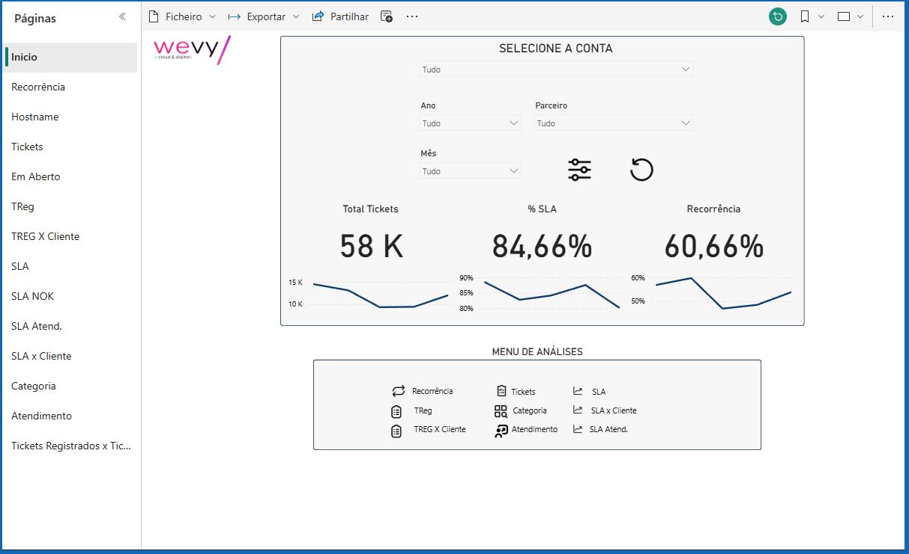

# SPRINT3_QA — Code Quality Review
Date: 2026-06-22

---

## charts.js — APROVADO

| Check | Status | Notes |
|-------|--------|-------|
| `initCharts()` implementada (não stub) | ✅ | Fetch `demo-data.json`, renderiza, wires filter |
| 3 charts instanciados | ✅ | line (`buildSlaChart`), doughnut (`buildDonutChart`), bar (`buildVolumeChart`) |
| Filtro destrói e recria | ✅ | Cada `build*` chama `.destroy()` antes de instanciar novo |
| Cores usam design tokens | ✅ | `#00D4AA`, `#9B9BAF`, `#1E1E2E` definidos como constantes no topo |
| `animation.duration` 600–1000ms | ✅ | `duration: 800` |

---

## animations.js — APROVADO

| Check | Status | Notes |
|-------|--------|-------|
| `gsap.registerPlugin(ScrollTrigger)` | ✅ | Linha 5, dentro de `initHeroAnimation()` |
| `initHeroAnimation()` com 5 elementos | ✅ | eyebrow, title, subtitle, cta, stats |
| ScrollTrigger em `[data-reveal]` com `once: true` | ✅ | `scrollTrigger: { trigger: el, start: 'top 85%', once: true }` |
| `prefers-reduced-motion` check antes do GSAP | ✅ | `!window.matchMedia('(prefers-reduced-motion: reduce)').matches` |

---

## index.html — SEO — APROVADO

| Check | Status | Notes |
|-------|--------|-------|
| `<meta name="robots">` | ✅ | `content="index, follow"` |
| `<link rel="canonical">` | ✅ | `https://vmittestainer.github.io` |
| og:title, og:description, og:url, og:image | ✅ | Todos presentes |
| JSON-LD `@type: Person` antes de `</body>` | ✅ | Linhas 421–433 |

---

## index.html — Performance — 2 PROBLEMAS

| Check | Status | Notes |
|-------|--------|-------|
| CDNs Chart.js e GSAP descomentados | ✅ | Linhas 22–24 |
| Scripts no final do `<body>` | ⚠️ PARCIAL | CDNs (Chart.js, GSAP, ScrollTrigger) estão no `<head>` sem `defer` — bloqueia rendering. Scripts locais estão corretos no fim do body (linhas 415–419). |
| Fontes com `font-display: swap` | ✅ | `&display=swap` no URL do Google Fonts |
| Imagens com `width` e `height` no HTML | ❌ AUSENTE | Nenhuma `` tem atributos `width`/`height` explícitos. Causa CLS (Cumulative Layout Shift) no Lighthouse. Afeta: hero avatar, about photo, 4 project cards. |

---

## Ações recomendadas (Sprint 3 → Sprint 4)

### 1 — CDN scripts: adicionar `defer` ou mover para fim do body

Opção mais simples — adicionar `defer` nos scripts do head:

```html
<script src="https://cdnjs.cloudflare.com/ajax/libs/Chart.js/4.4.1/chart.umd.min.js" defer></script>
<script src="https://cdnjs.cloudflare.com/ajax/libs/gsap/3.12.5/gsap.min.js" defer></script>
<script src="https://cdnjs.cloudflare.com/ajax/libs/gsap/3.12.5/ScrollTrigger.min.js" defer></script>
```

**Nota:** se mover para fim do body, garantir que ficam ANTES dos scripts locais.

### 2 — Imagens: adicionar `width` e `height`

Exemplos com dimensões reais (ajustar conforme os arquivos):

```html
<!-- Hero avatar -->


<!-- Project cards (proporção 16:9 ou conforme imagem real) -->

```

---

## Resultado geral

`charts.js` ✅ | `animations.js` ✅ | SEO ✅ | Performance ⚠️ 2 itens

**Status: APROVADO COM RESSALVAS** — código funcional e correto. Dois ajustes de performance recomendados antes do Lighthouse (Sprint 4).
